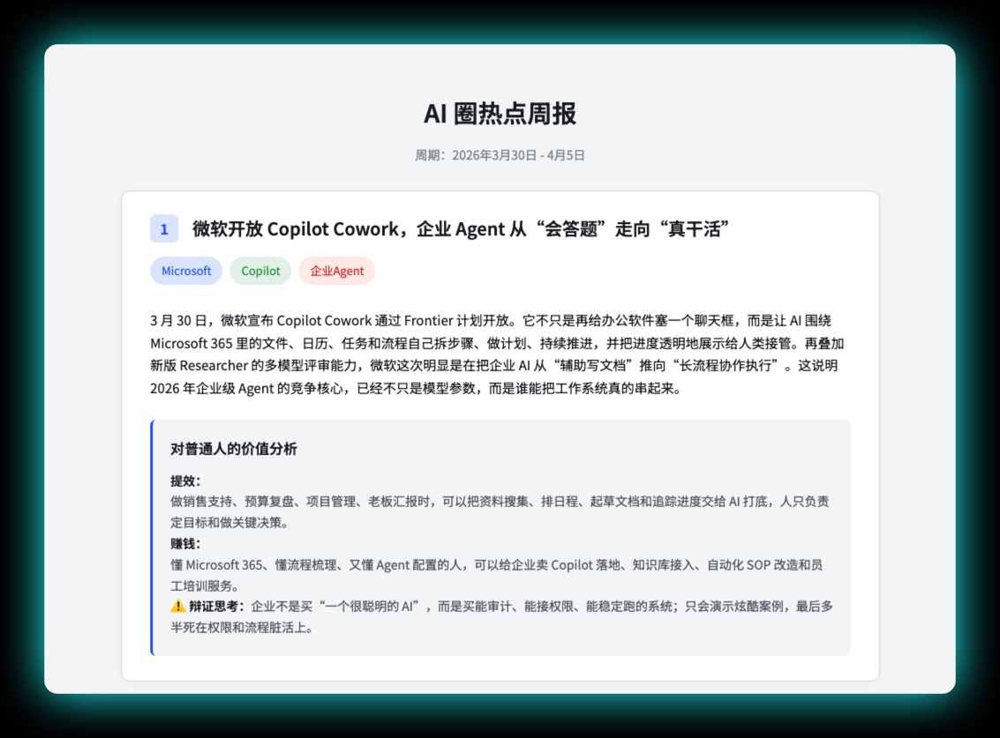

# AI圈热点周报 - 动态列表系统

一个现代化的AI新闻周报管理和展示系统，支持动态生成、自动排序和响应式展示。

## 📸 项目演示

### 新闻列表展示

*周报列表页面,支持搜索、筛选和统计功能*

### 新闻详情展示

*单个周报的详细内容展示*

## ✨ 特性

- 🎯 **智能序号管理** - 按时间顺序自动分配期数，最新内容优先显示
- 📱 **完全响应式** - 桌面、平板、手机完美适配
- 🔍 **实时搜索筛选** - 支持标题、内容、日期多维度搜索
- 🔄 **动态数据加载** - 基于JSON配置，支持热更新
- 📊 **自动统计面板** - 实时计算总期数、新闻数量等数据
- 🎨 **现代化UI** - 渐变背景、卡片设计、流畅动画
- ⚡ **自动化工具** - 一键扫描添加新周报

## 📁 文件结构

```
news_card/
├── dynamic-news-list.html    # 🎯 动态列表页面（推荐使用）
├── news-display.html         # 📋 静态列表页面（备用）
├── weekly-config.json        # ⚙️ 周报配置文件
├── update-config.js          # 🔧 自动更新脚本
├── 卡片模版.html              # 📄 周报制作模板
├── weeklies/                 # 📂 周报文件夹
│   ├── 20250804-20250810周新闻.html
│   ├── 20250818-20250824周新闻.html
│   └── ...                  # 其他周报文件
└── README.md                # 📖 使用说明
```

## 🚀 快速开始

### 1. 查看周报列表
打开 `dynamic-news-list.html` 即可查看所有周报，支持：
- 📊 实时统计数据展示
- 🔍 标题、日期搜索
- 📅 按月份筛选
- 🎯 智能排序（最新在前，序号递增）

### 2. 添加新周报

#### 方法一：自动扫描（推荐）✨
```bash
# 1. 将新周报文件放入 weeklies/ 文件夹
# 2. 运行扫描命令
node update-config.js scan
```

#### 方法二：手动添加
```bash
node update-config.js add "2025-10-01" "2025-10-07" "精彩内容描述" 15 8 4
```

#### 方法三：编辑配置文件
直接修改 `weekly-config.json`

### 3. 制作新周报
使用 `卡片模版.html` 作为模板，按照命名规则 `YYYYMMDD-YYYYMMDD周新闻.html` 保存到 `weeklies/` 文件夹

## 📋 配置文件格式

`weekly-config.json` 结构：
```json
{
  "weeklies": [
    {
      "date": "2025-09-22",           // 开始日期
      "endDate": "2025-09-28",        // 结束日期
      "filename": "20250922-20250928周新闻.html",  // 文件名
      "title": "AI圈热点周报 第7期",    // 标题
      "summary": "本周AI圈发生了...",   // 摘要
      "newsCount": 10,                // 新闻条数
      "toolCount": 5,                 // AI工具数
      "techCount": 3,                 // 技术突破数
      "published": true               // 是否已发布
    }
  ],
  "settings": {
    "autoDetectPattern": "^\\d{8}-\\d{8}周新闻\\.html$",
    "sortOrder": "desc",
    "baseTitle": "AI圈热点周报"
  }
}
```

## 🛠️ 脚本命令

### 查看帮助
```bash
node update-config.js help
```

### 扫描文件夹
```bash
node update-config.js scan
```
- 自动检测符合命名规则的文件
- 添加新发现的文件到配置
- 更新已存在文件的发布状态

### 添加新周报
```bash
node update-config.js add <开始日期> <结束日期> <标题> <简介> [新闻数] [工具数] [技术数]
```

示例：
```bash
node update-config.js add "2025-10-01" "2025-10-07" "第8期" "十月第一周AI圈精彩内容" 15 8 4
```

### 标记为已发布
```bash
node update-config.js publish <文件名>
```

## 📝 标准工作流程

### 添加新周报的完整流程：

1. **📝 制作周报内容**
   ```
   使用 卡片模版.html 制作新周报
   按格式命名: 20251001-20251007周新闻.html
   ```

2. **📂 保存到正确位置**
   ```
   将文件保存到 weeklies/ 文件夹
   ```

3. **🔄 自动扫描更新**
   ```bash
   node update-config.js scan
   ```

4. **✅ 查看结果**
   ```
   打开 dynamic-news-list.html 查看新增的周报
   自动分配序号，最新内容显示在顶部
   ```

### 🎯 序号与排序逻辑

- **序号分配**: 按时间顺序递增（第1期 = 最早，第N期 = 最新）
- **显示顺序**: 最新日期在顶部，便于用户快速找到最新内容
- **自动管理**: 无需手动调整序号，系统智能分配

## 🌟 功能特性

### 动态列表页面功能：
- ✅ 自动加载配置文件
- ✅ 实时搜索和筛选
- ✅ 按月份分类
- ✅ 自动统计数据
- ✅ 响应式设计
- ✅ 一键刷新
- ✅ 预览功能
- ✅ 待发布状态显示

### 自动化脚本功能：
- ✅ 文件自动扫描
- ✅ 批量添加/更新
- ✅ 智能排序
- ✅ 状态管理
- ✅ 错误处理

## 🔧 高级配置

### 修改命名规则
在 `weekly-config.json` 的 `settings.autoDetectPattern` 中修改正则表达式。

### 自定义排序
修改 `settings.sortOrder`：
- `"desc"`: 最新在前（默认）
- `"asc"`: 最早在前

### 修改基础标题
修改 `settings.baseTitle` 来改变默认标题前缀。

## 📊 当前状态

### 已发布周报
- 🆕 **第25期** (2026-01-19 至 01-25) - 最新发布，4条新闻，1个AI工具，2项技术突破
- ✨ **第24期** (2026-01-12 至 01-18) - 6条新闻，1个AI工具，3项技术突破
- ✨ **第23期** (2026-01-05 至 01-11) - 7条新闻，2个AI工具，3项技术突破
- ✨ **第22期** (2025-12-29 至 01-04) - 6条新闻，1个AI工具，3项技术突破
- ✨ **第21期** (2025-12-22 至 12-28) - 10条新闻，3个AI工具，5项技术突破
- ✨ **第20期** (2025-12-15 至 12-21) - 10条新闻，3个AI工具，5项技术突破
- ✨ **第19期** (2025-12-08 至 12-14) - 10条新闻，3个AI工具，6项技术突破
- ✨ **第18期** (2025-12-01 至 12-07) - 10条新闻，2个AI工具，7项技术突破
- ✨ **第17期** (2025-11-24 至 11-30) - 12条新闻，2个AI工具，8项技术突破
- ✨ **第16期** (2025-11-17 至 11-23) - 10条新闻，1个AI工具，4项技术突破
- 🎊 **第15期** (2025-11-10 至 11-16) - 11条新闻，3个AI工具，6项技术突破
- 🎉 **第14期** (2025-11-03 至 11-09) - 10条新闻，4个AI工具，7项技术突破
- 🚀 **第13期** (2025-10-27 至 11-02) - 10条新闻，2个AI工具，6项技术突破
- 📱 **第12期** (2025-10-20 至 10-26) - 10条新闻，2个AI工具，6项技术突破
- 🏆 **第11期** (2025-10-13 至 10-19) - 10条新闻，2个AI工具，8项技术突破
- 💡 **第10期** (2025-10-06 至 10-12) - 10条新闻，4个AI工具，4项技术突破
- 🌟 **第9期** (2025-09-29 至 10-05) - 10条新闻，2个AI工具，7项技术突破
- 📰 **第8期** (2025-09-22 至 09-28) - 13条新闻，2个AI工具，9项技术突破
- 📈 **第7期** (2025-09-15 至 09-21) - 15条新闻，6个AI工具，6项技术突破
- 🔥 **第6期** (2025-09-08 至 09-14) - 12条新闻，6个AI工具，7项技术突破
- ⭐ **第5期** (2025-09-01 至 09-07) - 4条新闻，1个AI工具，3项技术突破
- 🎯 **第4期** (2025-08-25 至 08-31) - 5条新闻，4个AI工具，3项技术突破
- 🌈 **第3期** (2025-08-18 至 08-24) - 10条新闻，3个AI工具，4项技术突破
- 💻 **第2期** (2025-08-11 至 08-17) - 10条新闻，3个AI工具，4项技术突破
- 📚 **第1期** (2025-08-04 至 08-10) - 4条新闻，4个AI工具，6项技术突破

**总计**: 25期周报，209条AI新闻，62个AI工具，120项技术突破，覆盖6个月时间(2025年8月-2026年1月)

## 🚨 注意事项

1. **文件命名**: 严格按照 `YYYYMMDD-YYYYMMDD周新闻.html` 格式
2. **文件位置**: 所有周报文件必须放在 `weeklies/` 文件夹中
3. **配置备份**: 定期备份 `weekly-config.json` 配置文件
4. **浏览器要求**: 需要支持 ES6+ 的现代浏览器
5. **服务器环境**: 建议在HTTP服务器环境下运行（避免CORS限制）

## 🌐 部署建议

### 本地开发
```bash
# 使用Python快速启动本地服务器
python -m http.server 8000
# 访问 http://localhost:8000/dynamic-news-list.html
```

### 生产环境
- 可直接部署到任何静态网站托管服务
- 支持 GitHub Pages、Netlify、Vercel 等平台
- 无需数据库，仅需静态文件托管

## 📱 设备支持

✅ 桌面端 (Chrome, Firefox, Safari, Edge)
✅ 平板设备 (iPad, Android 平板)
✅ 移动设备 (iOS Safari, Android Chrome)
✅ 响应式设计，自动适配所有屏幕尺寸
